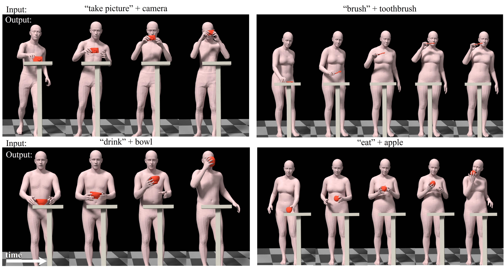

# IMoS: Intent-Driven Full-Body Motion Synthesis for Human-Object Interactions (Eurographics 2023)

[Paper](https://arxiv.org/pdf/2212.07555.pdf) | 
[Video](https://www.youtube.com/watch?v=3Ngi9k41-7c) | 
[Project Page](https://vcai.mpi-inf.mpg.de/projects/IMoS/)




## Pre-requisites
We have tested our code on the following setups: 
* Ubuntu 20.04 LTS
* Windows 10, 11
* Python >= 3.8
* Pytorch >= 1.11
* conda >= 4.9.2 (optional but recommended)

## Getting started

Follow these commands to create a conda environment:
```
conda create -n IDMS python=3.8
conda activate IDMS
conda install -c pytorch pytorch=1.11 torchvision cudatoolkit=11.3
pip install -r requirements.txt
```
For pytorch3D installation refer to https://github.com/facebookresearch/pytorch3d/blob/main/INSTALL.md

**Note:** If PyOpenGL installed using `requirements.txt` causes issues in Ubuntu, then install PyOpenGL using:
```
apt-get update
apt-get install python3-opengl
```
1. Follow the instructions on the [SMPL-X](https://smpl-x.is.tue.mpg.de) website to download SMPL-X model and keep the downloaded files under the `smplx_model` folder.

2. Download the GRAB dataset from the [GRAB website](https://grab.is.tue.mpg.de), and follow the instructions there to extract the files.
Save the raw data in `../DATASETS/GRAB`. 

3. To pre-process the GRAB dataset for our setting, run: 
```
python src/data_loader/dataset_preprocess.py
```
Download the pretrained weights for the models used in our paper from [here](https://drive.google.com/drive/folders/119JBZA98BxbRc3hEoA7keI3O685TkZS6?usp=share_link) and keep it inside `save\pretrained_models`.


4. To evaluate our pre-trained model, run:
```
python src/evaluate/eval.py
```
    
5. To generate the `.npy` files with the synthesized motions, run:
```
python src/test/test_synthesis.py
```

6. To visualize sample results from our paper, run:
```
python src/visualize/render_smplx.py
```

## License
This code is distributed under an [MIT LICENSE](LICENSE).
